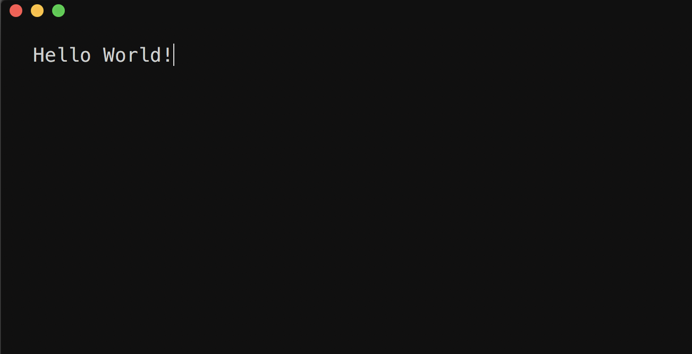

# Guide to making your first command line project with ncurses

## Intro
Everyone's first programming experience is on some form of command line, usually a hello world in your language of choice.

```
int main() {
    printf("Hello World!\n");
    return EXIT_SUCCESS;
}
```

But eventually you grow out of it, you start to think "the command line is only for debugging" well I'm here to defend the command line, and all of its glory. Writing full-blown apps in the command line is not only fun, but its easy, and it can look damn good (assuming you're down for a retro look). Making a game or app as a command line app is quicker and easier than messing around with complex graphics libraries, or god forbid, css.

This guide is going to be a look at how you can make command line apps and games (like [this one](https://github.com/harrinp/WalledIn)) simply and easily using the ncurses library. ncurses is a very common library for posix-compliant (_typically this means Macos and Linux_) command lines.

##### Caveats

This guide isn't going to go over anything to do with windows, ncurses supports posix compliant terminals. You may be able to get ncurses working on windows, but I offer no guarantees. Further, there are other libraries like ncurses which are for windows, namely [conio.h](https://en.wikipedia.org/wiki/Conio.h). I won't cover it here but the principles should be similar.

###### Other guides
I'm not the expert, just a dev who already went through this learning process. This guide is going to be a bare-bones "get up and running" lesson, you can find a more detailed explanation of ncurses and all of its capabilities [here](https://invisible-island.net/ncurses/ncurses.faq.html) and [here](http://tldp.org/HOWTO/NCURSES-Programming-HOWTO/).

###### Language choice
ncurses, like many libraries is a C library, I wrote all of these programs and examples in C, partly because that's the library language, and partly because C is beautiful. I'm a firm believer that programmers should have at least a working knowledge of the C language since it's a building block of basically everything. But I digress, you could also use C++ or something else, but you might need a different library or a connection method, my knowledge is nonexistant in this area. I recommend trying these examples in C, even if you aren't a C guru these examples should be easy to understand and expand upon. Have fun!

##### Example files

All example files will be included in the examples folder of this repository.

## Getting started

### Hello world v2

Lets redo our old hello world program and give it a fancy twist.

Make sure you include ncurses.h
```
#include <ncurses.h>
```

Now we need to initialize ncurses, and make sure we leave ncurses mode when we're done. This is done with initscr() and endwin().
```
int main() {
    initscr();
    printf("Hello World!\n");
    endwin();
    return EXIT_SUCCESS;
}
```

Now we need to update our printf with the ncurses variant, printw(). This works the same way as printf. Then we need to refresh() so that the data we've put in is shown. Then theres getch(), getch() is the ncurses function to get input as a character, but here we're using it so that the program will wait for a character before endwin(), where it clears the screen and returns to normal mode.

```
int main() {
    initscr();
    printw("Hello World!");
    refresh();
    getch();
    endwin();
    return EXIT_SUCCESS;
}
```
Compile - make sure to link ncurses with -lncurses
```
gcc helloWorld.c -o hello -lncurses
```
And run with `./hello`!



Fantastic, but thats not interesting. Lets spice it up. I'm going to now use mvprintw(), its the same as printw but you need to give it two coordinates, y then x, as the first two parameters.
```
int main() {
    initscr();
    mvprintw(5,5,"Hello World!");
    refresh();
    getch();
    endwin();
    return EXIT_SUCCESS;
}
```
Result:


See? We've moved the hello world down 5 lines down and 5 characters over.

### Terminal animation with ncurses

Now lets do something more interesting. We'll make a ball (the character 'o') and have it bounce off the walls of the terminal window.

We'll create a new file BouncingO.c, and add in two structs to hold our data.

```
// Stores our balls position
typedef struct _Ball {
    int x;
    int y;
} Ball;
// Stores the direction that the ball is moving
typedef struct _Direction {
    int x;
    int y;
} Direction;
```

Initialize with our ncurses functions
```
initscr();              // Start ncurses
nodelay(stdscr, TRUE);  // Don't wait for \n for getch to parse input
cbreak();               // Switch off input buffering
curs_set(FALSE);        // Don't place a cursor on the screen
```
Initialize our ball and window information
```
int height = 0;         // Window height
int width = 0;          // Window width

// initialize our ball struct and direction struct
Ball b = {
    1,1
};
Direction d = {
    1,1
};

// Get terminal window dimensions (rows and characters)
getmaxyx(stdscr, height, width);
```
Note: getmaxyx() does not get passed variable addresses, but it does change the variables you pass in.

And finally, make our "game" loop:

```
while (getch() == ERR) {
    // print ball
    mvprintw(b.y,b.x,"o");

    // move ball for next frame
    b.y += d.y;
    b.x += d.x;

    // Check for ball being outside of our window boundaries
    if (b.x == width - 1 || b.x == 0){
        // change direction
        d.x *= -1;
        b.x += d.x;
    }
    if (b.y == height - 1 || b.y == 0){
        // change direction
        d.y *= -1;
        b.y += d.y;
    }

    refresh();      // Refresh the output
    usleep(50000);  // Sleep to show output (Single frame)
    clear();        // Clear output
}
```
Most of this is self explanatory but its worth noting that refresh() and clear() are ncurses functions and usleep is a unistd.h function. The "game" logic of the ball is just adding the direction -1 or 1 to the ball each frame, and changing the direction when it contacts the edge.

Result:


Fun Right?

### Colors
Any self respecting game dev needs to use colors, ncurses makes this easy to do in the terminal. Because of the way that terminals work with color this has to be done with _color pairs_. 1 is the id of this color pair.

```
init_pair(1, COLOR_RED, COLOR_BLACK);  // Always start at 0
// This makes a red foreground on a black background
```

You then use it like this:
```
attron(COLOR_PAIR(1));  // Enable the color pair  
// Print something
attroff(COLOR_PAIR(1)); // Its good practice to disable it
```
This is nice but its hard to use easily, I find it best to abstract this process. Here's an example for a colored, multi-ball version of the bouncingO program.

This function abstracts away the color pair creation process. Basically, ncurses deals with colors as color pairs only, foreground and background. Since I only want to color the balls, I used -1 as the background (you MUST call use_default_colors() before doing this). Since I don't care which colors are which I'm just using a for loop to make all the possible color pairs with a blank background. When making your own program you may want to use just a single or a couple color pairs. You would make those like this: init_pair(ID, COLOR_RED, COLOR_WHITE); That will have a red letter on a white background. The IDs must start at 1 and go up.

```
void makeColorPairs(){
    for (int i = 0; i < 8; i++) {
        init_pair(i+1, i, -1);
    }
```
Then I use them by randomly selecting a color pair 1-8 for the balls. It looks like this after combining with randomized initial positions:


Here are the available colors in ncurses:
```
COLOR_BLACK   0
COLOR_RED     1
COLOR_GREEN   2
COLOR_YELLOW  3
COLOR_BLUE    4
COLOR_MAGENTA 5
COLOR_CYAN    6
COLOR_WHITE   7
```


## Making a larger project

Hopefully now you should be able to see how you could make a terminal project, but I'm going to run through how I made the small terminal screensaver shown above.

Repo here: [Bouncing Balls Repo](https://github.com/harrinp/BouncingBalls)

When making a full-blown game my strategy is to abstract these printing functions so that the game logic is separate from the printing functions. In c this means that I create a main function that calls all of my logic and printing functions, but I keep any printing outside of my logic functions. Here's my main for the bouncing balls screensaver:

```
int main(int argc, char *argv[]) {
    int numBalls = 100;          // If theres an argument process it
    if (argc > 1){
        numBalls = atoi(argv[1]);
        // Theres no safeguard for bad input (because I'm lazy) don't try this at home
    }
    srand(time(NULL));
    initscr();              // Start ncurses
    nodelay(stdscr, TRUE);  // Don't wait for \n for getch to parse input
    cbreak();               // Switch off input buffering
    curs_set(FALSE);        // Don't place a cursor on the screen
    start_color();
    use_default_colors();

    makeColorPairs();       // Abstracted color pair function

    Window w = initWindow(numBalls, 50000); // Initialize data structs

    while (getch() == ERR) {
        clear();                            // Clear screen
        moveBalls(&w);                      // Movement logic
        printWindow(&w);                    // Print the balls
        usleep(w.sleepTime);                // Sleep to show screen
    }
    destroyWindow(&w);
    nodelay(stdscr, FALSE);
    nocbreak();
    endwin();
    return 0;
}

```
moveBalls() and printWindow() are abstracted from each other. One big benefit of this is that you can then multithread these two processes so that the game logic (or input for a game) can be processed while the print function sleeps. I did this for [walled in](https://github.com/harrinp/WalledIn) which gave the program much better performance than it otherwise would have had.

the `while (getch() == ERR){}` waits for any key press and then ends the program if it gets one.

Important to this strategy is using structs to hold your data, this allows you to keep the printing and logic separate - just pass the address (a pointer) of the game data struct(s) around and manipulate/read them for logic/printing.

For this project my print function looked like this:
```
void printWindow(Window * w) {
    for (int i = 0; i < w->numBalls; i++) {
        attron(COLOR_PAIR(w->balls[i].colorPair));      // Applying the ball's color
        mvprintw(w->balls[i].y, w->balls[i].x, w->balls[i].avatar);
        attroff(COLOR_PAIR(w->balls[i].colorPair));     // Stop printing in this color
    }
}
```

And here are the structs:
```
typedef struct _Ball{
    // Position
    double x;
    double y;
    // How we display the ball
    char * avatar;
    // Speed (What we add to the x and y each loop iteration)
    double speedX;
    double speedY;

    int colorPair;
} Ball;

typedef struct _Window {
    int height;
    int width;
    int sleepTime;
    int numBalls;
    Ball * balls;
} Window;
```

## Conclusion
Hopefully this guide successfully illustrated how to make games for the terminal, and good strategy for constructing them. If you have any questions or suggestions please contact me!
