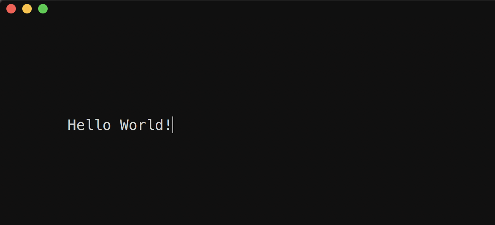

# Guide to making your first command line project with ncurses

## Intro
Everyone's first programming experience is on some form of command line, usually a hello world in your language of choice.

```
int main() {
    printf("Hello World!\n");
    return EXIT_SUCCESS;
}
```

But eventually you grow out of it, you start to think "the command line is only for debugging" well I'm here to defend the command line, and all of its glory. Writing full-blown apps in the command line is not only fun, but its easy, and it can look damn good (assuming your down for a retro look). Making a game or app as a command line app is quicker and easier than messing around with complex graphics libraries, or god forbid, css.

This guide is going to be a look at how you can make command line apps and games (like [this one](https://github.com/harrinp/WalledIn)) simply and easily using the ncurses library. ncurses is a very common library for posix-compliant (_typically this means Macos and Linux_) command lines.

##### Caveats

This guide isn't going to go over anything to do with windows, ncurses supports posix compliant terminals. You may be able to get ncurses working on windows, but I offer no guarantees. Further, there are other libraries like ncurses which are for windows, namely [conio.h](https://en.wikipedia.org/wiki/Conio.h). I won't cover it here but the principles should be similar.

I'm not the expert, just a dev who already went through this learning process. This guide is going to be a bare-bones "get up and running" lesson, you can find a more detailed explanation of ncurses and all of its capabilities [here](https://invisible-island.net/ncurses/ncurses.faq.html).

##### Example files

All example files will be included in the examples folder of this repository.

## Getting started

#### Hello world v2

Lets redo our old hello world program and give it a fancy twist.

Make sure you include nucrses.h
```
#include "ncurses.h"
```

Now we need to initialize ncurses, and make sure we leave ncurses mode when we're done. This is done with initscr() and endwin().
```
int main() {
    initscr();
    printf("Hello World!\n");
    endwin();
    return EXIT_SUCCESS;
}
```

Now we need to update our printf with the ncurses variant, printw(). This works the same way as printf. Then we need to refresh() so that the data we've put in is shown. Then theres getch(), getch() is the ncurses function to get input as a character, but here we're using it so that the program will wait for a character before endwin(), where it clears the screen and returns to normal mode.

```
int main() {
    initscr();
    printw("Hello World!");
    refresh();
    getch();
    endwin();
    return EXIT_SUCCESS;
}
```
Compile - make sure to link ncurses with -lncurses
```
gcc helloWorld.c -o hello -lncurses
```
And run!


Fantastic, but thats not interesting. Lets spice it up. I'm going to now use mvprintw(), its the same as printw but you need to give it two coordinates, y and x, as the first two parameters.
```
int main() {
    initscr();
    mvprintw(5,5,"Hello World!");
    refresh();
    getch();
    endwin();
    return EXIT_SUCCESS;
}
```
Result:



See? We've moved the hello world down 5 lines down and 5 characters over.

Now lets do something more interesting.
